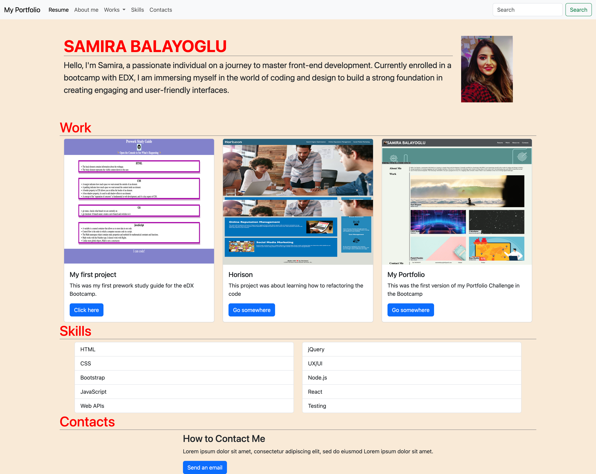

# Bootstrap-Portfolio

## Description

The website has header part with 5 links. When you click the Resume it will navigate to Github profile.

Other links it will navigate you to the related section in page. These are the sections: 
- Work
- About me
- Skills
- Contacts

Work section contains 3 subsections:
- My First Project
- Horison
- My Portfolio

Skills Section
- List out the skills you expect to learn from the bootcamp.

Contact section contains:
- Telephone
- Email

Footer Section
- Github
- Twitter
- Spotify

## Github page
Use the [Link](https://github.com/SamiraBalayoglu/Bootstrap-Portfolio) to access the page on Github.

## Home Page Screenshot

